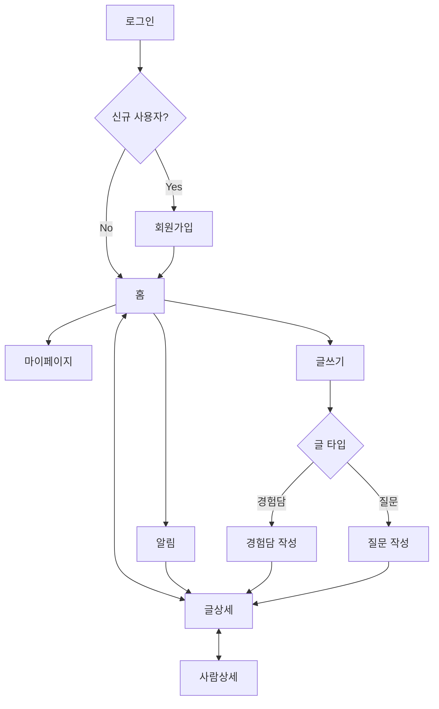
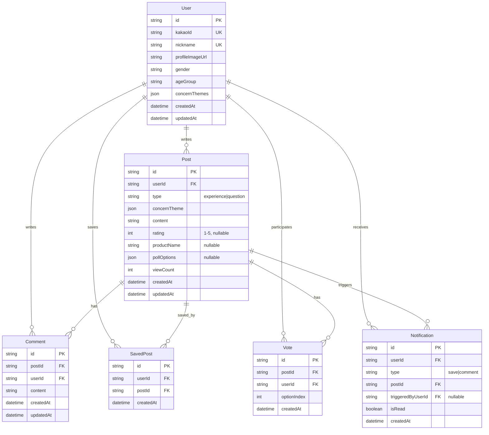
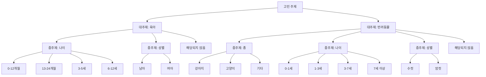

# 고뮤니티 MVP 기능 명세서

## 📋 프로젝트 개요

### 배경
커머스는 제품 중심 탐색으로, 특히 '고민 제품'(학습이 필요한 제품)을 찾는 과정에 높은 허들이 존재한다.

### 솔루션
사람들의 상호작용을 기반으로 한 소셜 커머스. 고민을 해결한 사람(Giver)과 고민을 가진 사람(Taker)을 연결하여 검증된 경험을 바탕으로 제품을 발견하고 선택할 수 있게 한다.

### 타겟 시장 (MVP)
무언가를 키우는 사람들 (육아, 반려동물)

### MVP 검증 가설

#### 생산 (콘텐츠 작성)
- **가설**: 경험담과 질문을 구분하면 글쓰기 목적이 명확해져 더 많은 글을 올릴 것
- **측정**: 전체 글 수, 경험담 수, 질문 수

#### 소비 (콘텐츠 읽기)
- **가설**: 나의 고민 주제에 맞는 글을 보여주면 더 많은 글을 읽을 것
- **측정**: 유저당 글 열람 수, 홈→상세 전환율

#### 만족도
- **가설**: 원하는 정보를 찾으면 저장할 것
- **측정**: 글 저장 수, 스크린샷 수, CSAT

---

## 🎯 User Stories & Acceptance Criteria

### Epic 1: 회원 인증 및 온보딩

#### US-1.1: 카카오 로그인
**As a** 신규/기존 사용자
**I want to** 카카오 계정으로 로그인하고
**So that** 간편하게 서비스를 시작할 수 있다

**Acceptance Criteria:**
- [ ] 카카오 OAuth 로그인 버튼이 표시된다
- [ ] 카카오 인증 성공 시 서버에서 kakaoId로 기존 회원 여부를 확인한다
- [ ] 기존 회원인 경우 JWT 토큰을 발급받고 홈으로 이동한다
- [ ] 신규 회원인 경우 회원가입 페이지로 이동한다
- [ ] 인증 실패 시 에러 메시지를 표시한다

**Technical Notes:**
- Supabase Auth + Kakao Provider 사용
- JWT 토큰은 localStorage에 안전하게 저장

---

#### US-1.2: 회원가입
**As a** 신규 사용자
**I want to** 내 정보와 관심 고민 주제를 등록하고
**So that** 나에게 맞는 콘텐츠를 추천받을 수 있다

**Acceptance Criteria:**
- [ ] 닉네임 입력 필드가 표시된다 (최대 10글자, 공백 불포함)
- [ ] 닉네임 입력 시 실시간 중복 체크가 수행된다
- [ ] 중복된 닉네임인 경우 에러 메시지를 표시한다
- [ ] 프로필 사진은 카카오 프로필 사진이 기본값으로 설정된다
- [ ] 프로필 사진을 변경할 수 있다
- [ ] 성별을 선택할 수 있다 (남자/여자, 라디오 버튼)
- [ ] 나이대를 선택할 수 있다 (20대 미만, 20대, 30대, 40대, 50대 이상, 드롭다운)
- [ ] 고민 주제 선택 폼이 표시된다
  - [ ] 대주제를 다중 선택할 수 있다 (육아, 반려동물)
  - [ ] 각 대주제별로 중주제를 선택할 수 있다
    - 육아: 나이(0-12개월, 13-24개월, 3-5세, 6-12세), 성별(남아/여아)
    - 반려동물: 종(강아지/고양이/기타), 나이(0-1세, 1-3세, 3-7세, 7세 이상), 성별(수컷/암컷)
  - [ ] '해당되지 않음' 옵션을 선택할 수 있다
- [ ] 모든 필수 정보 입력 완료 시에만 가입 완료 버튼이 활성화된다
- [ ] 가입 완료 시 JWT 토큰을 발급받고 홈으로 이동한다

**Technical Notes:**
- 닉네임 중복 체크는 debounce 적용 (500ms)
- 프로필 사진은 Supabase Storage에 업로드

---

### Epic 2: 콘텐츠 탐색 및 소비

#### US-2.1: 홈 피드 조회
**As a** 사용자
**I want to** 내 관심 주제의 글을 피드에서 보고
**So that** 다른 사람들의 경험과 질문을 탐색할 수 있다

**Acceptance Criteria:**
- [ ] 홈 피드가 카드 형식의 무한 스크롤로 표시된다
- [ ] 각 카드에는 다음 정보가 표시된다:
  - [ ] 작성자 프로필 사진
  - [ ] 작성자 닉네임
  - [ ] 고민 주제 태그 (대주제, 중주제)
  - [ ] 글 타입 배지 (경험담/질문)
  - [ ] 본문 미리보기 (최대 2줄, 말줄임표 처리)
  - [ ] 평점 (경험담인 경우만)
  - [ ] 댓글 수
  - [ ] 저장 수
- [ ] 내 고민 주제와 일치하는 글이 우선 표시된다
- [ ] 글은 최신순으로 정렬된다
- [ ] 스크롤 시 20개씩 추가 로딩된다
- [ ] 카드 클릭 시 글상세 페이지로 이동한다
- [ ] 작성자 프로필 사진/닉네임 클릭 시 사람상세 페이지로 이동한다
- [ ] 내 고민 주제 글이 최소 50% 이상 표시된다

**Technical Notes:**
- Intersection Observer API로 무한 스크롤 구현
- React Query로 데이터 캐싱 및 pagination

---

#### US-2.2: 글상세 조회
**As a** 사용자
**I want to** 글의 전체 내용과 댓글을 보고
**So that** 상세한 정보를 얻을 수 있다

**Acceptance Criteria:**

**작성자 정보:**
- [ ] 프로필 사진이 표시된다
- [ ] 닉네임이 표시된다
- [ ] 고민 주제가 표시된다
- [ ] 프로필 사진/닉네임/고민 주제 클릭 시 사람상세 페이지로 이동한다

**글 정보:**
- [ ] 고민 주제 (대주제, 중주제, 소주제)가 표시된다
- [ ] 글 타입 (경험담/질문)이 표시된다
- [ ] 본문 전체가 표시된다
- [ ] 평점이 표시된다 (경험담인 경우)
- [ ] 상품명이 표시된다 (있는 경우)
- [ ] 투표가 표시된다 (질문인 경우)
  - [ ] 투표 항목을 선택할 수 있다
  - [ ] 투표 참여 후 실시간 투표 결과가 표시된다
  - [ ] 투표 결과는 백분율로 표시된다
- [ ] 작성 시간이 표시된다
- [ ] 조회수가 표시된다

**상호작용:**
- [ ] 저장 버튼(북마크 아이콘)이 표시된다
- [ ] 저장 버튼 클릭 시 저장 상태가 토글된다
- [ ] 저장 수가 표시된다
- [ ] 댓글 작성 입력창이 표시된다 (최대 1500자)
- [ ] 댓글 목록이 최신순으로 표시된다
- [ ] 자신의 댓글만 수정/삭제 버튼이 표시된다
- [ ] 댓글 작성 시 실시간으로 목록에 추가된다
- [ ] 투표 참여 시 결과가 즉시 반영된다

**Technical Notes:**
- 조회수는 페이지 로드 시 1회만 증가
- 댓글은 Optimistic Update 적용

---

#### US-2.3: 사람상세 조회
**As a** 사용자
**I want to** 특정 회원의 프로필과 작성 글을 보고
**So that** 이 사람의 경험과 관심사를 탐색할 수 있다

**Acceptance Criteria:**

**회원 정보:**
- [ ] 프로필 사진이 크게 표시된다
- [ ] 닉네임이 표시된다
- [ ] 고민 주제 태그들이 표시된다 (대주제, 중주제)

**작성 글 목록:**
- [ ] 이 회원이 작성한 모든 글이 카드 형식으로 표시된다
- [ ] 카드 형식은 홈 피드와 동일하다
- [ ] 최신순으로 정렬된다
- [ ] 무한 스크롤로 추가 로딩된다
- [ ] 카드 클릭 시 해당 글상세 페이지로 이동한다
- [ ] 본인 프로필인 경우 편집 버튼이 표시되지 않는다

**Technical Notes:**
- 타인 프로필과 본인 프로필 UI는 동일

---

### Epic 3: 콘텐츠 작성

#### US-3.1: 경험담 작성
**As a** Giver
**I want to** 내가 겪은 고민 해결 경험을 공유하고
**So that** 같은 고민을 가진 사람들에게 도움을 줄 수 있다

**Acceptance Criteria:**
- [ ] 글쓰기 버튼 클릭 시 글 타입 선택 화면이 표시된다
- [ ] '경험담' 선택 시 경험담 작성 폼이 표시된다
- [ ] 고민 주제 선택 필드가 표시된다
  - [ ] 대주제를 선택할 수 있다
  - [ ] 중주제를 선택할 수 있다
  - [ ] 소주제를 자유롭게 입력할 수 있다 (최대 50자)
- [ ] 본문 입력 필드가 표시된다 (최대 3000자)
- [ ] 글자 수 카운터가 실시간으로 표시된다
- [ ] 평점 선택 UI가 표시된다 (1-5점, 별점)
- [ ] 상품명 입력 필드가 표시된다 (선택 사항)
- [ ] 모든 필수 정보 입력 완료 시에만 작성 완료 버튼이 활성화된다
- [ ] 작성 완료 시 글상세 페이지로 이동한다
- [ ] 작성 중 뒤로가기 시 작성 중단 확인 모달이 표시된다

**Technical Notes:**
- 자동 저장 기능은 MVP에서 제외
- Draft 기능은 MVP에서 제외

---

#### US-3.2: 질문 작성
**As a** Taker
**I want to** 고민에 대한 질문을 올리고
**So that** 경험자들의 조언을 받을 수 있다

**Acceptance Criteria:**
- [ ] 글쓰기 버튼 클릭 시 글 타입 선택 화면이 표시된다
- [ ] '질문' 선택 시 질문 작성 폼이 표시된다
- [ ] 고민 주제 선택 필드가 표시된다
  - [ ] 대주제를 선택할 수 있다
  - [ ] 중주제를 선택할 수 있다
  - [ ] 소주제를 자유롭게 입력할 수 있다 (최대 50자)
- [ ] 본문 입력 필드가 표시된다 (최대 3000자)
- [ ] 글자 수 카운터가 실시간으로 표시된다
- [ ] 투표 항목 추가 UI가 표시된다 (선택 사항)
  - [ ] 투표 항목을 2-5개 추가할 수 있다
  - [ ] 각 항목은 최대 100자까지 입력 가능하다
  - [ ] 항목 추가/삭제 버튼이 표시된다
- [ ] 모든 필수 정보 입력 완료 시에만 작성 완료 버튼이 활성화된다
- [ ] 작성 완료 시 글상세 페이지로 이동한다
- [ ] 작성 중 뒤로가기 시 작성 중단 확인 모달이 표시된다

**Technical Notes:**
- 투표 항목은 동적으로 추가/삭제 가능
- 투표는 선택 사항

---

### Epic 4: 마이페이지 및 설정

#### US-4.1: 마이페이지 조회 및 편집
**As a** 사용자
**I want to** 내 프로필과 저장한 글을 관리하고
**So that** 나의 활동을 관리할 수 있다

**Acceptance Criteria:**

**프로필 정보:**
- [ ] 프로필 사진이 표시된다
- [ ] 프로필 사진 클릭 시 수정 UI가 표시된다
- [ ] 새 사진 업로드 시 미리보기가 표시된다
- [ ] 닉네임이 표시된다
- [ ] 닉네임 클릭 시 수정 UI가 표시된다
- [ ] 닉네임 수정 시 실시간 중복 체크가 수행된다
- [ ] 고민 주제가 표시된다
- [ ] 고민 주제 클릭 시 수정 UI가 표시된다
- [ ] 수정 사항 저장 시 즉시 반영된다

**저장한 글:**
- [ ] 내가 저장한 글 목록이 카드 형식으로 표시된다
- [ ] 최신순으로 정렬된다
- [ ] 무한 스크롤로 추가 로딩된다
- [ ] 카드 클릭 시 글상세 페이지로 이동한다
- [ ] 저장 취소 시 목록에서 즉시 제거된다

**설정:**
- [ ] 알림(푸시) 수신 ON/OFF 토글이 표시된다
- [ ] 토글 변경 시 즉시 저장된다

**Technical Notes:**
- 닉네임 중복 체크는 debounce 적용 (500ms)
- 고민 주제 수정 시 피드 추천 알고리즘 즉시 반영

---

### Epic 5: 알림

#### US-5.1: 알림 수신 및 조회
**As a** 사용자
**I want to** 내 글에 대한 반응을 알림으로 받고
**So that** 빠르게 확인하고 응답할 수 있다

**Acceptance Criteria:**

**저장 알림:**
- [ ] 내 글이 n회 이상 저장되면 알림이 발송된다 (n은 설정값, 예: 5회)
- [ ] 알림 메시지: "회원님의 글이 n명에게 저장되었어요!"
- [ ] 알림 클릭 시 해당 글상세 페이지로 이동한다

**댓글 알림:**
- [ ] 내 글에 댓글이 달리면 알림이 발송된다
- [ ] 알림 메시지: "[닉네임]님이 댓글을 남겼어요"
- [ ] 알림 클릭 시 해당 글상세 페이지로 이동한다

**알림 목록:**
- [ ] 알림 목록이 시간순으로 정렬된다 (최신 위)
- [ ] 읽음/안읽음 상태가 표시된다
- [ ] 무한 스크롤로 추가 로딩된다
- [ ] 알림 클릭 시 읽음 처리된다
- [ ] 해당 콘텐츠로 정확히 이동한다

**푸시 알림:**
- [ ] 마이페이지에서 푸시 수신을 설정할 수 있다
- [ ] 앱이 백그라운드일 때도 알림을 수신한다
- [ ] 푸시 알림 클릭 시 앱이 열리고 해당 페이지로 이동한다

**Technical Notes:**
- Firebase Cloud Messaging (FCM) 사용
- 알림 설정은 사용자별로 관리

---

## 🏗 시스템 아키텍처

### 화면 플로우

### 데이터 모델

### 도메인 모델: 고민 주제 (Concern Theme)

---

## 🎨 UI/UX 가이드라인

### 디자인 원칙
1. **모바일 퍼스트**: 모든 화면은 모바일에 최적화
2. **단순함**: 불필요한 요소 제거, 핵심 기능에 집중
3. **접근성**: 터치 타겟 44x44pt 이상, 스크린 리더 지원
4. **일관성**: 동일한 패턴과 컴포넌트 재사용

### 주요 컴포넌트
- **PostCard**: 홈 피드 및 사람상세에서 사용되는 글 카드
- **ThemeSelector**: 고민 주제 선택 UI
- **CommentList**: 댓글 목록 및 작성 UI
- **PollVote**: 투표 참여 및 결과 표시 UI

---

## 📊 성공 지표 (Analytics)

### 생산 지표
| 지표 | 목표 | 측정 방법 |
|------|------|-----------|
| 일일 신규 글 수 | 50+ | 일일 Post 생성 수 |
| 경험담 vs 질문 비율 | 4:6 | Post type별 집계 |
| 사용자당 평균 글 작성 수 | 2+ | 총 글 수 / MAU |

### 소비 지표
| 지표 | 목표 | 측정 방법 |
|------|------|-----------|
| DAU | 100+ | 일일 활성 사용자 수 |
| 사용자당 평균 글 열람 수 | 10+ | 일일 조회 수 / DAU |
| 홈→글상세 전환율 | 30%+ | 글상세 조회 / 홈 카드 노출 |
| 평균 체류 시간 | 5분+ | 세션 시간 평균 |

### 만족도 지표
| 지표 | 목표 | 측정 방법 |
|------|------|-----------|
| 글 저장 수 | 200+/day | 일일 SavedPost 생성 수 |
| 저장률 | 5%+ | 저장 수 / 조회 수 |
| 재방문율 | 30%+ | 7일 내 재방문 사용자 / 신규 사용자 |

---

## 🚫 MVP 스코프 아웃

다음 기능들은 MVP에서 제외:
- ❌ 각 글에 '고민 제품' 직접 연결
- ❌ 커머스 기능 (상품 전시, 장바구니, 결제)
- ❌ 좋아요 기능
- ❌ 팔로우/팔로잉 기능
- ❌ 검색 기능
- ❌ 해시태그
- ❌ 글 공유하기
- ❌ 신고/차단 기능
- ❌ 자동 저장 (Draft)

---

## 🔒 비기능 요구사항

### 성능
- 피드 로딩: 2초 이내
- 글상세 로딩: 1초 이내
- 이미지 로딩: 3초 이내
- 앱 초기 로딩: 3초 이내

### 보안
- 카카오 OAuth 토큰 안전한 저장
- API 요청 시 JWT 토큰 검증
- 본인 글/댓글만 수정/삭제 가능
- Supabase RLS(Row Level Security) 정책 적용
- XSS, CSRF 방어

### 접근성
- 모바일 최적화 (터치 타겟 44x44pt 이상)
- 스크린 리더 지원
- 색상 대비비 4.5:1 이상 (WCAG AA)
- 키보드 네비게이션 지원

### 호환성
- iOS 14 이상
- Android 8.0 이상
- 최신 Chrome, Safari, Firefox

---

## 📝 기술 스택

- **Framework**: Next.js 14 (App Router)
- **Language**: TypeScript
- **Styling**: Tailwind CSS
- **UI Components**: Radix UI (shadcn/ui)
- **State Management**: Zustand
- **Database**: Supabase (PostgreSQL)
- **Authentication**: Supabase Auth + Kakao Provider
- **File Storage**: Supabase Storage
- **Push Notification**: Firebase Cloud Messaging
- **Deployment**: Vercel
- **Analytics**: Vercel Analytics + Google Analytics 4

---

## 🗓 마일스톤

### Phase 1: 인증 및 온보딩 (Week 1-2)
- [ ] 카카오 로그인 구현
- [ ] 회원가입 플로우 구현
- [ ] 고민 주제 선택 UI 구현

### Phase 2: 콘텐츠 작성 (Week 3-4)
- [ ] 경험담 작성 기능
- [ ] 질문 작성 기능
- [ ] 투표 기능

### Phase 3: 콘텐츠 탐색 (Week 5-6)
- [ ] 홈 피드 구현
- [ ] 글상세 페이지 구현
- [ ] 댓글 기능
- [ ] 저장 기능

### Phase 4: 프로필 및 알림 (Week 7-8)
- [ ] 사람상세 페이지 구현
- [ ] 마이페이지 구현
- [ ] 알림 시스템 구현
- [ ] 푸시 알림 구현

### Phase 5: 테스트 및 배포 (Week 9-10)
- [ ] E2E 테스트
- [ ] 성능 최적화
- [ ] 베타 테스트
- [ ] 정식 출시

---

## 📚 참고 자료

- [Supabase Documentation](https://supabase.com/docs)
- [Next.js Documentation](https://nextjs.org/docs)
- [Radix UI Documentation](https://www.radix-ui.com/docs)
- [Kakao Developers](https://developers.kakao.com/)
- [Firebase Cloud Messaging](https://firebase.google.com/docs/cloud-messaging)
